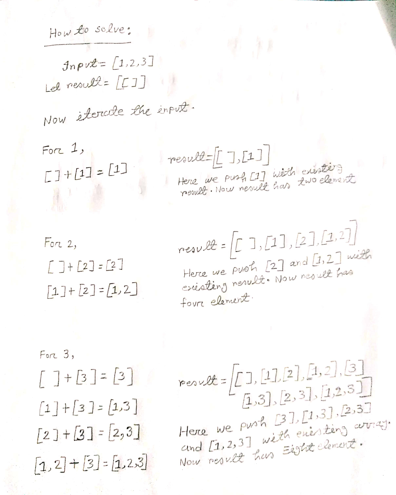

[78. Subsets](https://leetcode.com/problems/subsets/)

 * Q:
 *  1. What is the size/length of input?
 *  2. Does the solution set contain empty subsets?
 *  3. Do we have runtime or space limit?
 *  4. Can the input be empty or null?
 *  5. Do the subsets have an order? Is the [1, 2] equal to [2, 1]?


### <span style="color:orange; font-weight:700">Solution - 1 : Brute Force(Iterative approach/ Dynamic Programming) 0(n*2^n)</span>

Intution behind iterative approach / dynamic programming:

<div align="center">
</div>
<br><br>

Dynamic Programming: Building up the result step by step with the same baby step.

```
Two nested loop to use DP to build the result from [] to all.
  [] => [1] == [],[1]
  [],[1] => [2],[1, 2] == [],[1],[2],[1,2] 
  [],[1],[2],[1,2]  => [3],[1,3],[2,3],[1,2,3] == [],[1],[2],[1,2],[3],[1,3],[2,3],[1,2,3]
```

<div align="center">
</div>
<br><br>

Why it is not BFS?

Actually, it is not BFS, For example, we have ```[1, 2, 3]```. if it is BFS, the order should be ```[ ], [1], [2], [3], [1, 2],[1, 3], [2, 3], [1, 2, 3]```. But this code's output order is ```[], [1], [2], [1, 2], [3], [1, 3], [2, 3], [1, 2, 3]```. Technically. It is just follow the principle: add a new number or not. (add to where ? to all of subsets we have).

Video references:

- [subsets dp-1](https://www.youtube.com/watch?v=EBufetmjleY)
- [subsets dp-2](https://www.youtube.com/watch?v=kYY9DotIKlo)
- [subsets dp-3](https://www.youtube.com/watch?v=1BbeOUkUOak)

```javascript

// 1st for loop time complexity: O(n)
// 2nd for loop time complexity
// 1+2^1+2^2+……+2^n = 2^(n+1)-1.
// So the time coplexity of second for loop is O(2^n)


// Time and space complexity: O(n*2^n) 
// Time and space complexity explanation: Time complexity is O(n*2^n) and same for space. Here, we loop through each number in the nums array once, which is O(n). For each number we go through, we double the size of result, thus the next for loop will take twice as long, hence O(2^n). Multiplying them together since they are nested, we have O(n*2^n) for both time and space.

var subsets = function(nums) {
    const result = [[]];
    for(let i=0;i<nums.length;i++){// O(n)
        let size = result.length;
        for(let j=0;j<size;j++){ // O(2^n)
            result.push([...result[j],nums[i]]);
        }
    }
    return result;
};
```

### <span style="color:orange; font-weight:700">Solution - 2 : DFS-1 0(n*2^n)</span>

This is one of the popular template for solving lot's of problem based on recursion, backtracking and dfs.

- https://leetcode.com/problems/subsets/discuss/973667/Backtracking-Template-or-Explanation-%2B-Visual-or-Python 
  
Why it is dfs? Because here we explore all the nodes in the array and don't have any constraints.

Debug and draw recursion tree for better understanding.

```javascript
function dfs(nums,result,subset,left){

    // push each subset into the result
    result.push([...subset]); // Time complexity O(n)

    for(let i=left;i<nums.length;i++){ // Time complexity O(2^n)
        //choose
        subset.push(nums[i])

        //explore
        dfs(nums,result,subset,i+1)

        //unchoose
        subset.pop();
    }
}
var subsets = function(nums) {
    dfs(nums,result=[],subset=[],left=0)
    return result;
};

console.log(subsets([1,2,3]));
```

#### <span style="color:greenyellow; font-weight:700">Recursion Tree</span>

<div align="center">
</div>
<br><br>

### <span style="color:orange; font-weight:700">Solution - 3 : DFS-2 0(n*2^n)</span>

```
Input: nums = [1,2,3]
Output: [[],[1],[2],[1,2],[3],[1,3],[2,3],[1,2,3]]
```

This is another popular template for solving lot's of problem based on recursion, backtracking and dfs.

#### <span style="color:greenyellow; font-weight:700"> Intution</span>

Look at the output pattern, A outer array is contain multiple inner array.Based on the output pattern, we must need ```set/result=[]``` and ```subsets=[]``` variables. Also we take ```i=0``` variable for track down the nums for making decision tree. Whenever ```i``` is equal to the length of the array, it meets the base condition.


video solution
- [subset dfs-1](https://www.youtube.com/watch?v=H1Bvm3VF03Y)
- [subset dfs-2](https://www.youtube.com/watch?v=4paR1cZx9Tg)

```javascript
// Time and space complexity: O(n*2^n)

function dfs(nums,subset,result,i){
    if(i===nums.length){
        // here we copy new subset into the result each time. Copying operation is related to the size of the subset, and worst case is when subset has n elements. So copying takes n. So the time complexity is O(n). Why we copy it? Because subset is a reference data type, so when subset value change, the result will also change. That's why we make copy of the subset.
        result.push([...subset]); // option-1

        // option-2 
        // Here we already make a copy of subset before in option-2. So we don't need to copy subset again.
        // result.push(subset); 

        return;
    }

    //take element: option-1
    subset.push(nums[i]); // whenever we push a element into the subset, the previous subset value also change, because array is a reference data type in JavaScript. If we push something in subset, it reference the same subset array. That's why we need to pop() the element when we go back to its previous state otherwise subset value will be same.
    dfs(nums,subset,result,i+1)
    subset.pop();

    // For take element we can write the following way also : option-2
    // dfs(nums,[...subset,nums[i]],result,i+1); // In this case we don't push or pop anything. Here we making a new subset unique copy in every dfs function call, so each subset value is different from the previous function. So whenever we go back to the previous function call we get subset previous value. That's why we don't need to pop subset. This is the difference between this code block and the above code block.


    // don't take or skip element
    dfs(nums,subset,result,i+1)
}

var subsets = function(nums) {
    dfs(nums,subset=[],result=[],i=0)
    return result;
};
```
#### <span style="color:greenyellow; font-weight:700">Recursive Tree</span>

<div align="center">
</div>
<br><br>

It is so time consuming to draw recursion tree for multiple function recursion. So we need to shorten them. To short the recursion tree, we need to concern about only the the part really matters and make the tree based on the importent part.

<div align="center">
</div>
<br><br>


