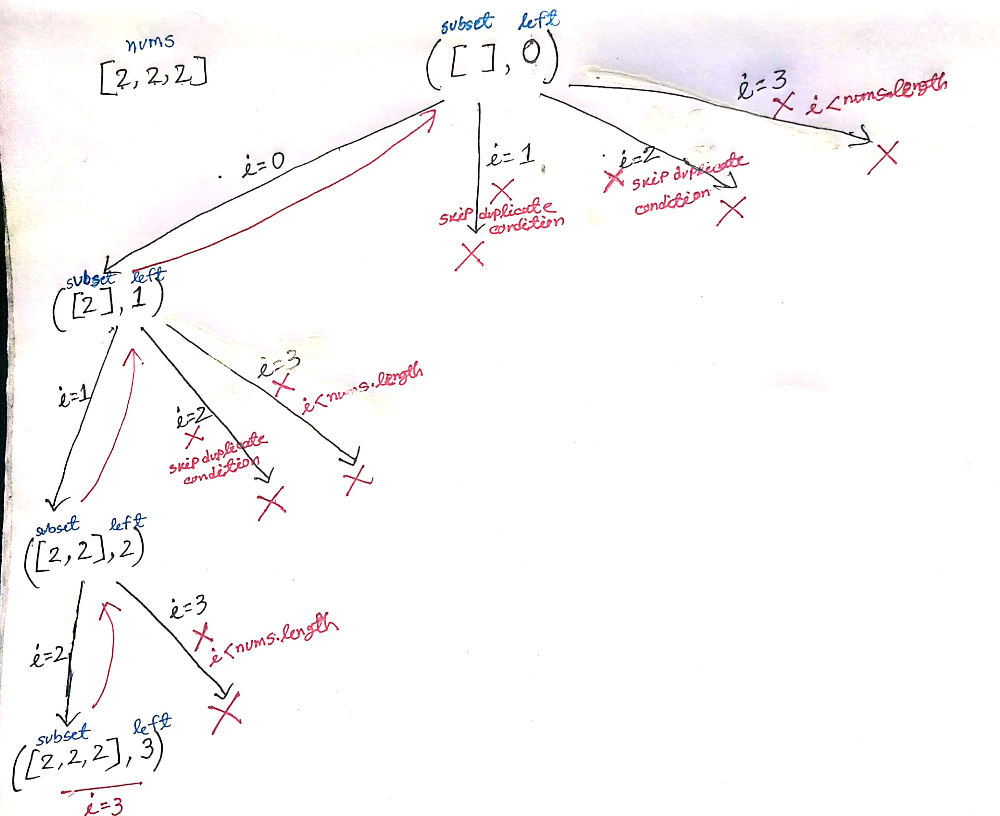
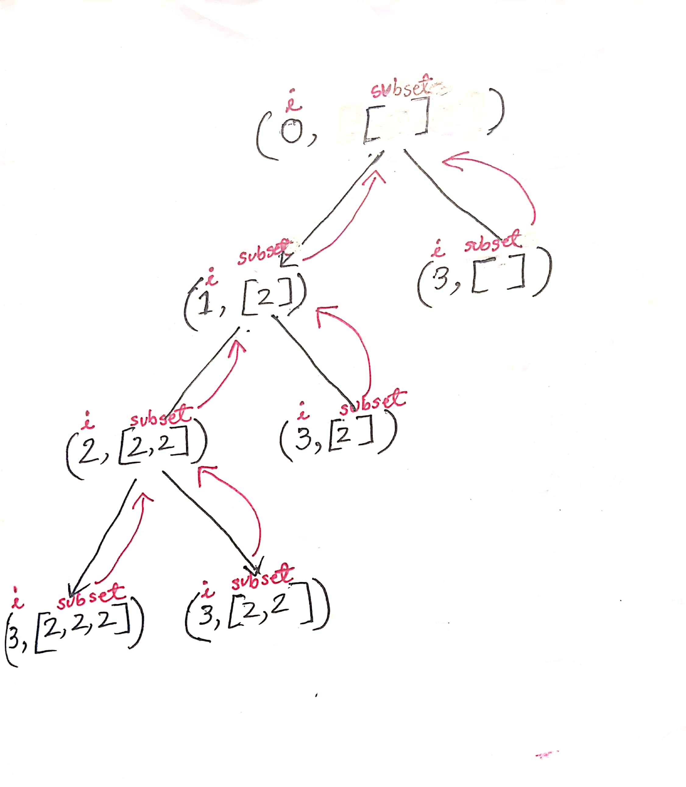

[90. Subsets II](https://leetcode.com/problems/subsets-ii/)

### <span style="color:orange; font-weight:700">Solution - 1 : Backtrack-1 ```0(n*2^n)```</span>

This is one of the popular templates for solving lot's of problem based on recursion and backtracking.

Why it is backtracking? As we have constraints (remove the duplicate), so we can say that it is backtracking. In dfs it's not necessary to have a constraint but in backtracking, you must have a constraint.

#### <span style="color:greenyellow; font-weight:700"> Intuition </span>

- When we start calling the backtrack function, rightmost branch of the tree goes as much deep until it gets the leaf node. Then it back to the previous place where it was called.

- For the first series backtrack function call(until go to the leaf node(see the rightmost tree branch) ), we don't want to skip any subset possibility, although the adjecent number are same(e.g. [2,2,2]). In condition it's look like(i===left && nums[i]===nums[i-1]).

- When we start popping subset(go back to the previous place where it was called), value of ```i``` start incrementing. At that time left is not equal to i(i!==left). Form this point we want to skip duplicate subset. That's why our condition is look like this ```i!==left && nums[i]===nums[i-1]```

- https://leetcode.com/problems/subsets-ii/discuss/1380366/Java-or-Python-or-Recursion-Visualization


```javascript
function backtrack(nums,left,subset,result){
  result.push([...subset]);

  for(let i=left;i<nums.length;i++){
    // To skip duplicate
    if(i !==left && nums[i] === nums[i-1]){
      continue;
    }

    // choose
    subset.push(nums[i]);
    //explore
    backtrack(nums,i+1,subset,result);
    // unchoose
    subset.pop();

  }
}
var subsetsWithDup = function(nums) {
  nums.sort((a,b)=> a-b)
  backtrack(nums,left=0,subset=[],result=[]);   
  return result;
};

console.log(subsetsWithDup([2,2,2]));
```
#### <span style="color:greenyellow; font-weight:700">Recursion Tree</span>

<div align="center">
</div>
<br><br>


### <span style="color:orange; font-weight:700">Solution - 2 : Backtrack-2 ```0(n*2^n)```</span>

This is another popular template for solving lot's of problem based on recursion and backtracking.

Why it is backtrack? As we have a constraints (remove the duplicate), so we can say that it is backtracking. In dfs it's not necessary to have a constraint but in backtracking you must have a constraint.

#### <span style="color:greenyellow; font-weight:700">Intution</span>

- At first solve the unique element with subsets question.
- We have to skip the duplicate subsets from the array.
- Before start recursion you have to sort the array, otherwise you can't detect      duplicate element.
- Whenever a duplicate found(in nums), we should have skip it untill we find the unique element. That's why using while loop is a better choice to avoid duplicate and get unique element.
- A duplicate list occurs when,
  ```i<nums.length-1 && nums[i]===nums[i+1]```
- We execute the rightmost branch of the recursive tree first and then pop out and back to the previous ```i``` value. Then we decide it the next element(from nums) is duplicate then skip it.
- Debug and draw recursive/decision tree for better understanding
- https://www.youtube.com/watch?v=Vn2v6ajA7U0&t=83s

```javascript
function backtrack(nums,i,subset,result){
  if(i===nums.length){
      result.push([...subset]); // option-1

      // option-2 
      // Here we already make a copy of subset before in option-2. So we don't need to copy subset again.
      // result.push(subset);

      return;
  }
  //take element : option-1
  subset.push(nums[i]);
  backtrack(nums,i+1,subset,result);
  subset.pop();

  // For take element we can write the following way also : option-2
  // dfs(nums,i+1,[...subset,nums[i]],result);

  // skip the duplicate subsets
  while(i<nums.length-1 && nums[i]===nums[i+1]){
      i+=1;
  }

  // skip element
  backtrack(nums,i+1,subset,result);


}
var subsetsWithDup = function(nums) {
  // sorting
  nums.sort();

  backtrack(nums,i=0,subsets=[],result=[]);
  return result;
};

console.log(subsetsWithDup([2,2,2]));
```

<span style="color:palevioletred; font-weight:700">Recursion Tree</span>

<div align="center">
</div>
<br><br>

