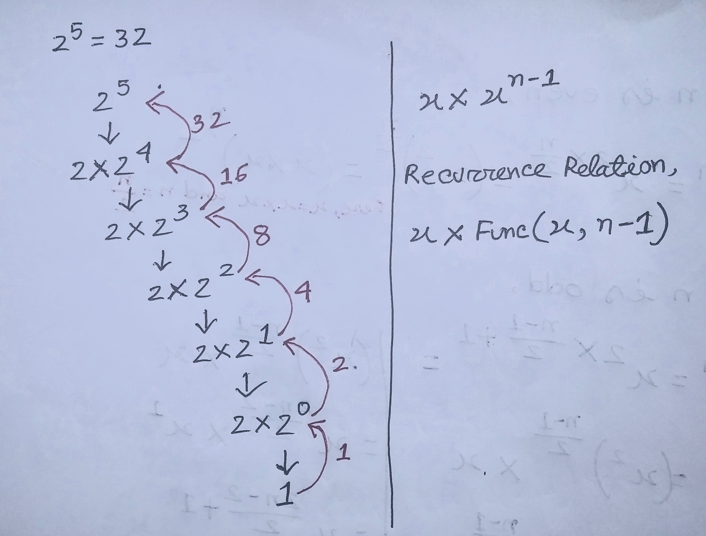
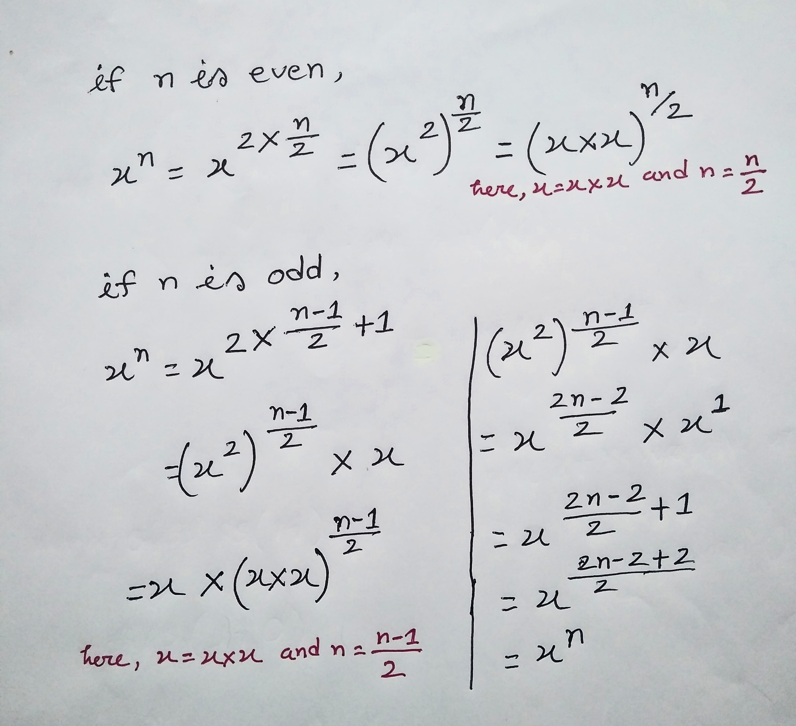

[50. Pow(x, n)](https://leetcode.com/problems/powx-n/)


### <span style="color:orange; font-weight:700">Solution - 1 : Brute Force-1 0(n)</span>

```javascript
// Understand the Question
// We have to implement pow(x,n) that means x to the power n
// 2 to the power 10 is similar to writing 2 ten times (2*2*2*2*2*2*2*2*2*2) which is equal to 1024

// Brute Force approach
// We can make a for loop and run it untill it reaches the power value n.
// But for negative number, for do not work, that's why we can user Math.abs() method for make the value positive.
// Whenver power value is negative,we have to divide it by 1, so 1/result will be answer for negative integer.
// Time complexity : O(n) and Space complexity : O(1)
// Limitation
// Whenever the value of n or power is too large, it may causes time limit exceed. 

var myPow = function(x, n) {
    let result = 1;
    for(let i=0;i<Math.abs(n);i++){
        result *= x;
    }

    if(n<0){
        result = 1/result;
    }
    return result;
};

```

### <span style="color:orange; font-weight:700">Solution - 2 : Brute Force-2 0(n)</span>

```javascript

// Brute Force approach
// Three case can be possible : value of n is 0 , value of n is positive integer, value of n is negative integer
 // case - 1 : power value 0
    // whenever power value is 0 in any exponent then the result must be 1
 // case-2 : power value is positive
    // whenever power value is positive integer / greater than 0 , then we can multiply x  n-times
 // case-3 : power value is negative
    // whenver power value is negative integer / less than 0 , then we can multiply 1/x  n-times
// Time complexity: O(n) and Space complexity : O(1)

// Limitation
// Whenever the value of n or power is too large, it may causes time limit exceed. 

var myPow = function(x, n) {
    let result = 1; 
    if(n===0){ // For power value 0
        return 1
    }else if(n>0){ // For power value positive integer
        while(n!==0){
            result *= x
            n-=1;
        }
    }else{
        while(n!==0){ // For power value negative integer
            result *= 1/x
            n+=1;
        }
    }
    
    return result;
};
```


### <span style="color:orange; font-weight:700">Solution - 3 : Recursive Approach-1 0(n)</span>

<span style="color:palevioletred; font-weight:700">Intution</span>

<div align="center">
</div>

<br><br>


```javascript
// Recursive approach
// When the value of n is negative,we need to make it positive, that's why we can user Math.abs() method for make the value positive. Math.abs() method is just like modulus.
// Whenver power value is negative,we have to divide it by 1, so 1/result will be answer for negative integer.
// Time complexity : O(n) and Space complexity : O(n)
// Limitation
// Whenever the value of n or power is too large, it may causes time limit exceed. That's why we need O(logn) solution.

function helperFunc(x,n){
    // base case
    if(n===0){
        return 1;
    }
    // recurrence relation
    return x * helperFunc(x,n-1);
}
var myPow = function(x, n) {
    // Use Math.abs() method for making n value positive
    let  result = helperFunc(x,Math.abs(n));

    // For negative value of n
    if(n<0){
        result = 1/result;
    }
    // For 0 and positive value of n
    return result;
};
```
<span style="color:palevioletred; font-weight:700">Recursion Tree</span>

<div align="center">
</div>
<br><br>

### <span style="color:orange; font-weight:700">Solution - 4 : Recursive Approach-2 0(logn)</span>

Basic ideas <br>
(x <sup>a</sup>) <sup>b</sup> = x <sup>a * b</sup>
<br>

Therefore, 
- if n is even, <br>
  x <sup>n</sup> = x <sup>2 * n &frasl; 2 </sup> = (x <sup>2</sup>) <sup> n &frasl; 2</sup>

- if n is odd, <br>
  x <sup>n</sup> = x <sup>2 * (n-1) &frasl; 2 + 1 </sup>  = (x <sup>2</sup>) <sup>(n-1) &frasl; 2</sup> * x 

This way, we can reach x <sup>n</sup> in O(logN) time . 


<div align="center">
</div>

<br><br>

```javascript

// Intution

// case-1 : n equal 0
   // whenever n equal 0 we can return 1

// case-2 : n is negative
   // When the value of n is negative,we need to make it positive, that's why we can use Math.abs() method for make the value positive. Math.abs() method is just like modulus.
   // Whenver power value is negative,we have to divide it by 1, so 1/result will be answer for negative integer.

// For postive value 2 case can be possible, either it is even or it is odd

// case-3 : n is even number
   // after did some math, we can return myPow(x*x, n/2)

// case-4 : n is odd number
   // after did some math, we can return x * myPow(x*x, (n-1)/2)

// Time complexity: O(logn) and Space complexity: O(1)

function helperFunc(x,n){

    // case-1 : base condition(here the recursion stop)
    if(n===0){
        return 1
    }
    
    // case-3 : n is even number
    if(n%2===0){
        return helperFunc(x*x,n/2)
    }
    
    // case-4 : n is odd number
    //if(n%2===1)
    return x * helperFunc(x*x, (n-1)/2);       
}

var myPow = function(x, n) {
    let result = helperFunc(x,Math.abs(n));

    // case-2 : n is negative
    if(n<0){
        return 1/result;
    }

    return result   
};
```
<span style="color:palevioletred; font-weight:700">Recursion Tree</span>

<div align="center">
</div>
<br><br>

### <span style="color:orange; font-weight:700">References</span>
- [Pow(x, n) | LeetCode 50 | Calculate Power of a Number](https://www.youtube.com/watch?v=GyL7FJn0gso)